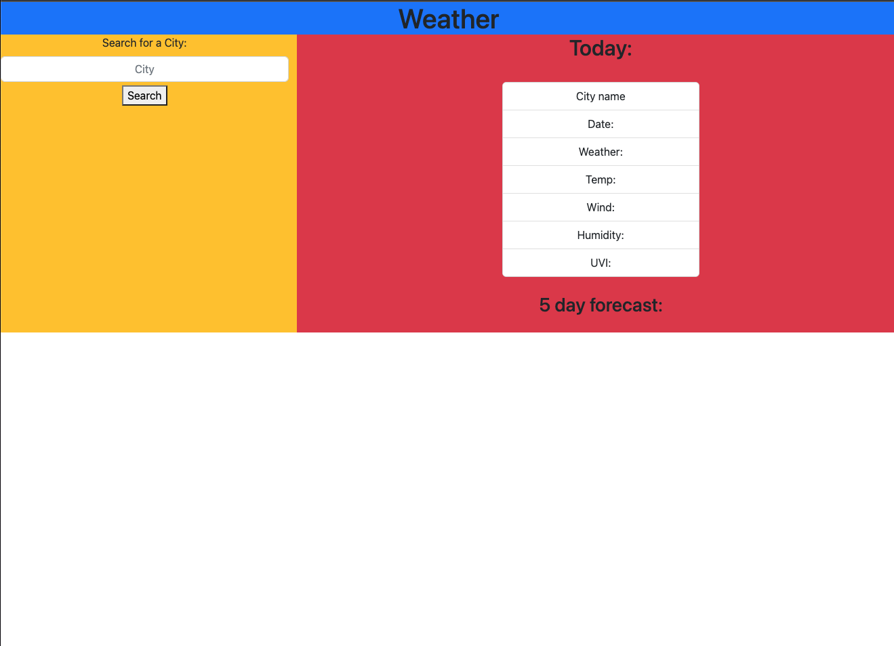

# Weather App

## Description

This is a small weather application tha makes use of a third party API to serve weather data about cities. It formats the data in a similar way to google weather. I used the Open Weather API, localStorage, and bootstrap. 

Deployed: https://brownj47.github.io/weather-app/

